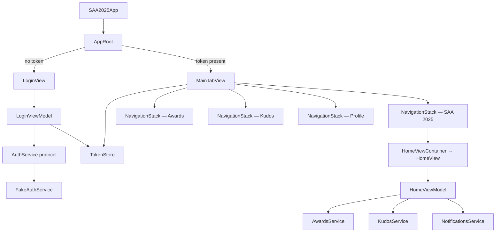
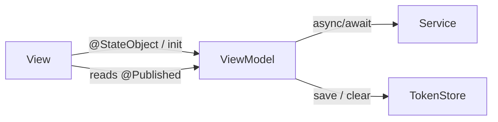
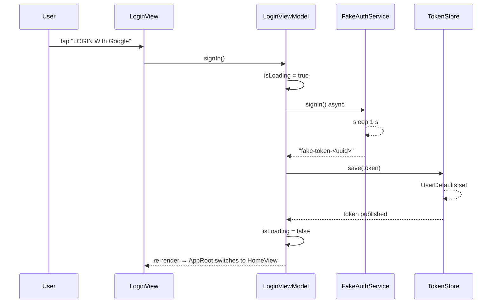

# System Architecture

## App Entry Point

`SAA2025App` is the `@main` entry. It instantiates a single `WindowGroup` containing `AppRoot`.

```
SAA2025App  →  AppRoot  →  (token present?) MainTabView : LoginView
```

`AppRoot` owns a `@StateObject TokenStore`. On every change to `tokenStore.token` it animates between screens:

- `token == nil` → `LoginView(tokenStore:)`
- `token != nil` → `MainTabView().environmentObject(tokenStore)`

## Tab Navigation Structure

`MainTabView` is the authenticated root. Each tab wraps its own `NavigationStack` so back-stacks are preserved independently when switching tabs.

| Tab index | Label | Root view | System image |
|-----------|-------|-----------|-------------|
| 0 | SAA 2025 | `HomeViewContainer` | `house.fill` |
| 1 | Awards | `AwardsTabView` | `trophy.fill` |
| 2 | Kudos | `KudosTabView` | `heart.fill` |
| 3 | Profile | `ProfileTabView` | `person.fill` |

Tab tint color: `saaGold` (#D9A656) from `Assets.xcassets/saaGold.colorset`.

`HomeViewContainer` is a thin wrapper that resolves `@EnvironmentObject` before forwarding `TokenStore` into `HomeViewModel`'s initialiser.

## Layer Diagram



## MVVM Relationship



- **View** is passive — it reads `@Published` state and forwards user actions.
- **ViewModel** is `@MainActor final class ObservableObject` — owns all business logic.
- **Service** is a `protocol` — production vs. stub swapped at the call site (default arg).

## OAuth Stub Flow



On error the ViewModel sets `showError = true` which triggers a SwiftUI `.alert`.

## Services

All services follow the same pattern: a `protocol` defines the contract; a `Fake*` class implements it with a simulated `Config.mockApiDelay` delay; the real implementation is injected at the call site via default argument.

| Protocol | Fake implementation | Contract | Production replacement |
|----------|--------------------|-----------|-----------------------|
| `AuthService` | `FakeAuthService` | `signIn() async throws -> String` | GoogleSignIn-iOS SDK |
| `AwardsService` | `FakeAwardsService` | `loadAwards() async throws -> [Award]` | REST awards endpoint |
| `KudosService` | `FakeKudosService` | `loadKudos() async throws -> KudosInfo` | REST kudos endpoint |
| `NotificationsService` | `FakeNotificationsService` | `loadSummary() async throws -> NotificationSummary` | REST / WebSocket |
| `TokenStore` | — | `ObservableObject`; persists `"auth.token"` to `UserDefaults` | Migrate to Keychain |
| `Localizer` | — | `ObservableObject`; `t(_ key:)` looks up VN dict | Populate EN/JA dicts |

### ServiceError

`ServiceError` is the shared error enum thrown by service implementations. ViewModels pattern-match against it to route auth failures:

- `.unauthorized` → `tokenStore.clear()` (back to Login)
- `.forbidden` → navigate to `AccessDeniedView`
- `.network` / `.unknown` → surface in `LoadState.error`

### LoadState\<T\>

`LoadState<T>` is the generic async state machine used by every ViewModel that loads remote data.

```swift
enum LoadState<T> {
    case idle
    case loading
    case loaded(T)
    case empty
    case error(Error)
}
```

Convenience computed properties: `isLoading`, `value`, `isEmpty`, `error` — defined in an extension in `LoadState.swift`.

### Config

`Config` is a caseless enum in `Config.swift` that centralises all compile-time tunables and feature flags:

| Constant | Type | Value | Purpose |
|----------|------|-------|---------|
| `eventDate` | `Date` | 2026-12-26 00:00 UTC | Countdown target on Home screen |
| `isKudosAvailable` | `Bool` | `true` | Feature flag: show Kudos tab and FAB actions |
| `mockApiDelay` | `Duration` | `.seconds(1)` | Artificial latency injected by all Fake services |

## Folder Structure

```
SAA2025/
├── SAA2025App.swift              # @main entry
├── AppRoot.swift                 # Login ↔ MainTabView router
├── Config.swift                  # Compile-time constants + feature flags
├── Navigation/
│   └── MainTabView.swift         # 4-tab root for authenticated users
├── Features/
│   ├── Login/
│   │   ├── LoginView.swift
│   │   ├── LoginViewModel.swift
│   │   └── Components/
│   │       ├── GoogleSignInButton.swift
│   │       └── LanguagePicker.swift
│   ├── Home/
│   │   ├── HomeView.swift        # HomeViewContainer + HomeView
│   │   ├── HomeViewModel.swift
│   │   └── Components/
│   │       ├── HomeHeader.swift
│   │       ├── HeroSection.swift
│   │       ├── CountdownCard.swift
│   │       ├── EventInfoCard.swift
│   │       ├── ThemeNoteSection.swift
│   │       ├── AwardsSection.swift
│   │       ├── AwardCard.swift
│   │       ├── KudosSection.swift
│   │       ├── KudosBanner.swift
│   │       └── FloatingActionButton.swift
│   ├── Awards/
│   │   ├── AwardsTabView.swift       # stub
│   │   ├── AwardsOverviewView.swift  # stub
│   │   └── AwardDetailView.swift     # stub (typed nav deferred)
│   ├── Kudos/
│   │   ├── KudosTabView.swift        # stub
│   │   ├── KudosOverviewView.swift   # stub
│   │   └── KudosFeedView.swift       # stub
│   ├── WriteKudo/
│   │   └── WriteKudoView.swift       # stub
│   ├── Profile/
│   │   └── ProfileTabView.swift      # stub
│   ├── Search/
│   │   └── SearchView.swift          # stub
│   ├── Notifications/
│   │   └── NotificationsView.swift   # stub
│   └── AccessDenied/
│       └── AccessDeniedView.swift    # stub; Back-to-Login clears token
├── Services/
│   ├── AuthService.swift             # protocol + FakeAuthService
│   ├── AwardsService.swift           # protocol + FakeAwardsService
│   ├── KudosService.swift            # protocol + FakeKudosService
│   ├── NotificationsService.swift    # protocol + FakeNotificationsService
│   ├── LoadState.swift               # generic async state enum
│   ├── TokenStore.swift
│   └── Localizer.swift
└── Assets.xcassets/
    ├── KeyvisualBG.imageset
    ├── SunAALogo.imageset
    ├── RootFurtherLogo.imageset
    ├── GoogleGLogo.imageset
    ├── TopTalentBadge.imageset       # award badge — PNG crop from preview.png
    ├── TopProjectBadge.imageset      # award badge — PNG crop from preview.png
    ├── TopInnovationBadge.imageset   # award badge — PNG crop from preview.png
    ├── KudosBanner.imageset          # kudos hero — PNG crop from preview.png
    └── saaGold.colorset              # #D9A656 — tab bar tint
```

## Asset Catalog Convention

All image assets live in `SAA2025/Assets.xcassets/` as named imagesets.
Reference by name string in SwiftUI: `Image("KeyvisualBG")`.
Use `@1x / @2x / @3x` scale slots per imageset — never hard-code pixel sizes in the catalog.
