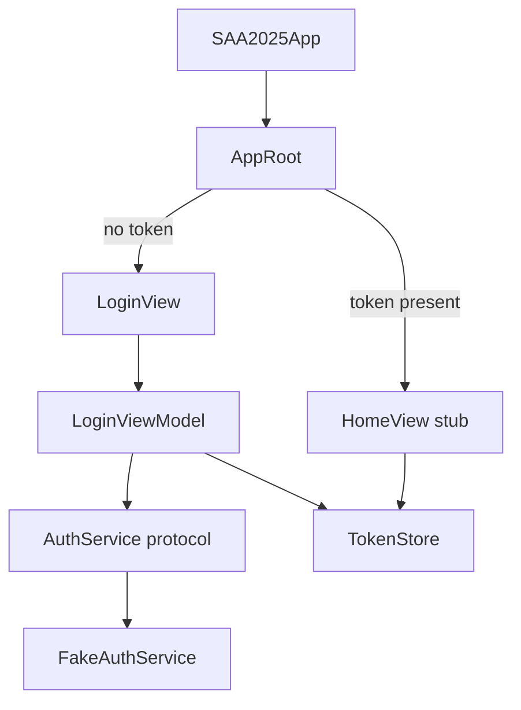
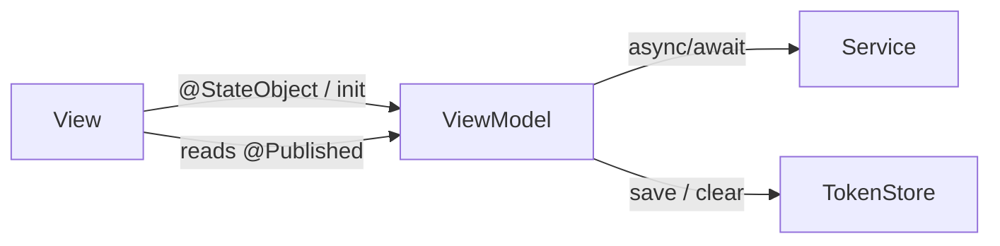
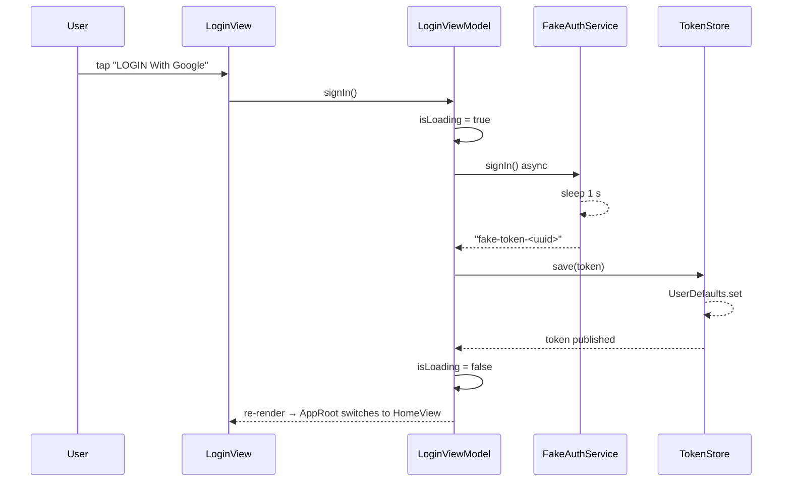

# System Architecture

## App Entry Point

`SAA2025App` is the `@main` entry. It instantiates a single `WindowGroup` containing `AppRoot`.

```
SAA2025App  →  AppRoot  →  (token present?) LoginView : HomeView
```

`AppRoot` owns a `@StateObject TokenStore`. On every change to `tokenStore.token` it animates between screens:

- `token == nil` → `LoginView(tokenStore:)`
- `token != nil` → `HomeView().environmentObject(tokenStore)`

## Layer Diagram



## MVVM Relationship



- **View** is passive — it reads `@Published` state and forwards user actions.
- **ViewModel** is `@MainActor final class ObservableObject` — owns all business logic.
- **Service** is a `protocol` — production vs. stub swapped at the call site (default arg).

## OAuth Stub Flow



On error the ViewModel sets `showError = true` which triggers a SwiftUI `.alert`.

## Services

| Type | Role | Production replacement |
|------|------|------------------------|
| `protocol AuthService` | Sign-in contract: `signIn() async throws -> String` | GoogleSignIn-iOS SDK implementation |
| `FakeAuthService` | 1 s delay → returns `"fake-token-<uuid>"` | Replace when OAuth is wired |
| `TokenStore` | `ObservableObject`; persists token key `"auth.token"` to `UserDefaults` | Migrate to Keychain |
| `Localizer` | `ObservableObject`; `t(_ key:)` looks up VN dict; EN/JA dicts empty | Populate dicts; re-render on `lang` change |

## Folder Structure

```
SAA2025/
├── SAA2025App.swift          # @main entry
├── AppRoot.swift             # Login ↔ Home router
├── Features/
│   ├── Login/
│   │   ├── LoginView.swift
│   │   ├── LoginViewModel.swift
│   │   └── Components/
│   │       ├── GoogleSignInButton.swift
│   │       └── LanguagePicker.swift
│   └── Home/
│       └── HomeView.swift    # stub
├── Services/
│   ├── AuthService.swift     # protocol + FakeAuthService
│   ├── TokenStore.swift
│   └── Localizer.swift
└── Assets.xcassets/
    ├── KeyvisualBG.imageset
    ├── SunAALogo.imageset
    ├── RootFurtherLogo.imageset
    └── GoogleGLogo.imageset
```

## Asset Catalog Convention

All image assets live in `SAA2025/Assets.xcassets/` as named imagesets.
Reference by name string in SwiftUI: `Image("KeyvisualBG")`.
Use `@1x / @2x / @3x` scale slots per imageset — never hard-code pixel sizes in the catalog.
